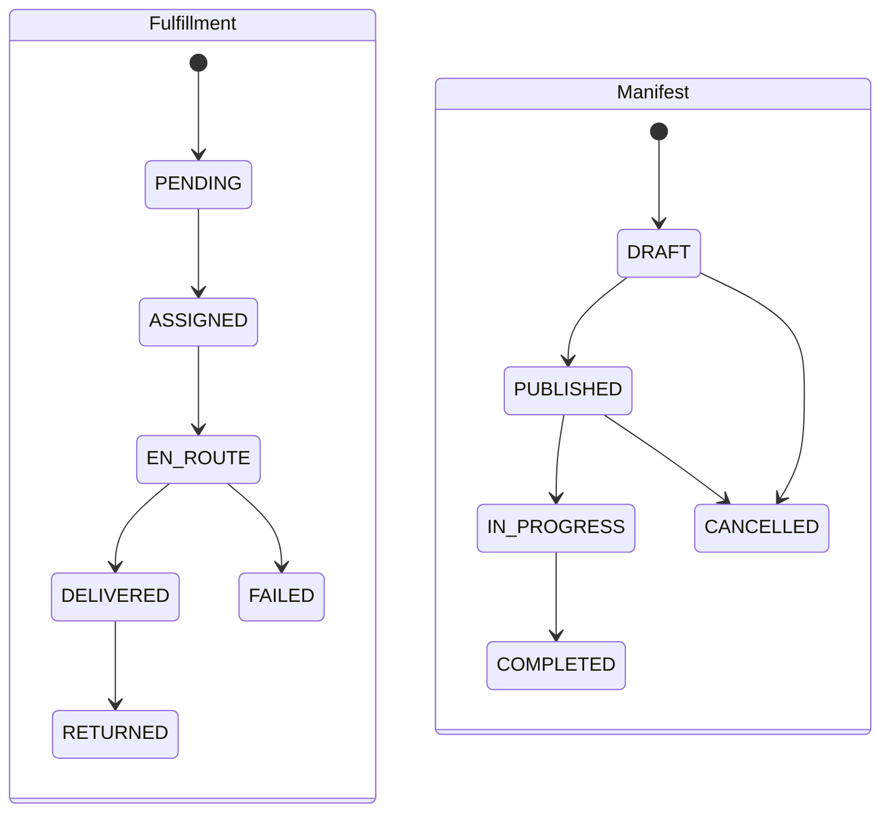
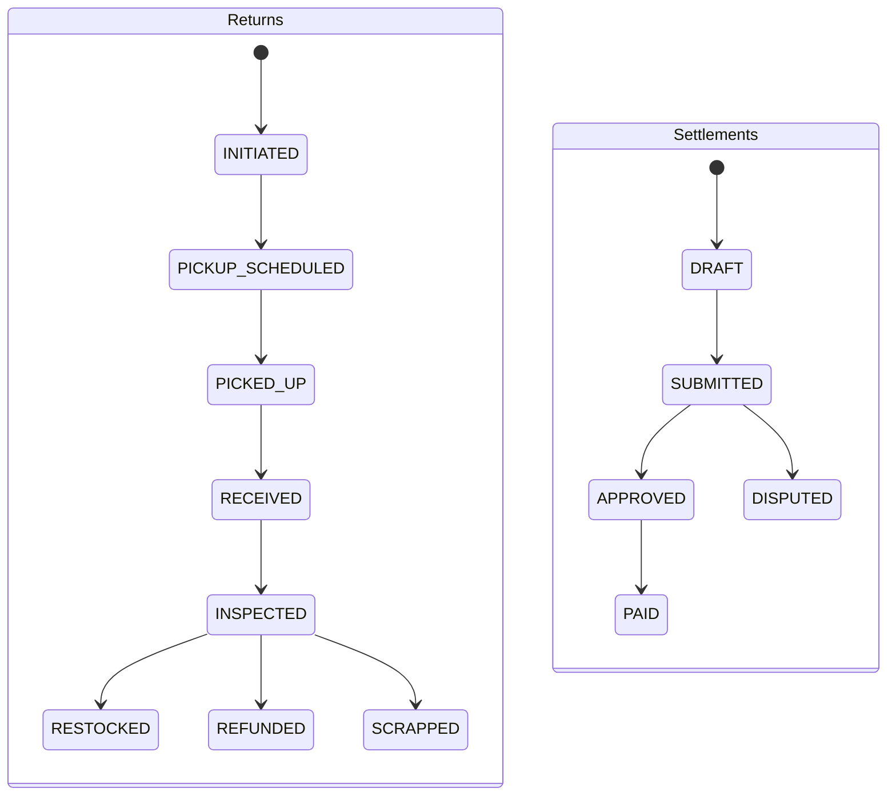

# SmartLogix API — Complete Reference Documentation 🚚

> **Base URL**: `http://localhost:8081`  
> **Content-Type**: `application/json`  
> **Swagger UI**: `http://localhost:8081/swagger-ui.html`  
> **Integration Test**: `99 / 99 PASSED` ✅

All responses follow the standard envelope format:
```json
{ 
  "success": true, 
  "message": "...", 
  "data": { ... }, 
  "timestamp": "..." 
}
```

---

## 🗂 Module Index

| Foundation | Fleet & Network | Delivery Lifecycle | Tracking & Finance |
|:---|:---|:---|:---|
| 1. [Users](#1-users) | 5. [Vehicles](#5-vehicles) | 9. [Fulfillments](#9-fulfillments) | 13. [Delivery Returns](#13-delivery-returns) |
| 2. [Merchants](#2-merchants) | 6. [Drivers](#6-drivers) | 10. [Tracking Events](#10-tracking-events) | 14. [Manifests](#14-manifests) |
| 3. [Service Zones](#3-service-zones) | 7. [Carriers](#7-carriers) | 11. [Proof of Delivery](#11-proof-of-delivery) | 15. [Carrier Bookings](#15-carrier-bookings) |
| 4. [Depots](#4-depots) | 8. [Pricing Rules](#8-pricing-rules) | 12. [Exceptions](#12-delivery-exceptions) | 16. [Settlements](#16-carrier-settlements) |

---

## 1. Users

**Valid Roles**: `LOGISTICS_MANAGER`, `DISPATCHER`, `DRIVER`, `CUSTOMER`, `MERCHANT`, `CARRIER`, `FINANCE_OFFICER`, `ADMINISTRATOR`  
**Valid Statuses**: `ACTIVE`, `INACTIVE`, `SUSPENDED`

### `POST` `/users` — Create User
<details>
<summary>View Request Payload</summary>

```json
{
  "name": "Bob Driver",
  "role": "DRIVER",
  "email": "bob@smartlogix.io",
  "phone": "91-98765-00001",
  "password": "Passw0rd!123",
  "mfaEnabled": false
}
```
</details>

*   **`GET` `/users/{id}`** — Get User by ID
*   **`GET` `/users/by-email?email={email}`** — Get User by Email
*   **`GET` `/users?page=0&size=20&role={role}`** — List Users (paginated, optional role filter)
*   **`PATCH` `/users/{id}/status?status={status}`** — Update User Status
*   **`DELETE` `/users/{id}`** — Delete User

---

## 2. Merchants

### `POST` `/merchants` — Create Merchant
<details>
<summary>View Request Payload</summary>

```json
{
  "name": "TechGadgets Inc",
  "contactInfoJson": "{\"email\":\"ops@techgadgets.io\",\"phone\":\"1800-100-200\"}",
  "billingTermsJson": "{\"net\":30,\"currency\":\"USD\"}"
}
```
</details>

*   **`GET` `/merchants/{id}`** — Get Merchant by ID
*   **`GET` `/merchants?page=0&size=20`** — List Merchants (paginated)

---

## 3. Service Zones

**Valid Statuses**: `ACTIVE`, `INACTIVE` (controlled via `/activate` and `/deactivate`)

### `POST` `/zones` — Create Service Zone
<details>
<summary>View Request Payload</summary>

```json
{
  "name": "North Mumbai",
  "timeZone": "Asia/Kolkata",
  "capacityPerSlot": 80,
  "polygonGeoJson": "{\"type\":\"Polygon\",\"coordinates\":[[[72.8,18.9],[72.9,18.9],[72.9,19.0],[72.8,19.0],[72.8,18.9]]]}",
  "postalCodesJson": "[\"400001\",\"400002\",\"400003\"]",
  "slaConfigJson": "{\"standardHours\":24,\"expressHours\":4}"
}
```
</details>

*   **`GET` `/zones/{id}`** — Get Zone by ID
*   **`GET` `/zones?page=0&size=20`** — List Zones (paginated)
*   **`POST` `/zones/{id}/activate`** — Activate Zone
*   **`POST` `/zones/{id}/deactivate`** — Deactivate Zone

---

## 4. Depots

### `POST` `/depots` — Create Depot
<details>
<summary>View Request Payload</summary>

```json
{
  "name": "Mumbai Central Depot",
  "timeZone": "Asia/Kolkata",
  "addressJson": "{\"street\":\"NH-8 Industrial Area\",\"city\":\"Mumbai\",\"state\":\"Maharashtra\",\"pincode\":\"400063\"}"
}
```
</details>

*   **`GET` `/depots/{id}`** — Get Depot by ID
*   **`GET` `/depots?page=0&size=20`** — List Depots (paginated)

---

## 5. Vehicles

**Valid Types**: `VAN`, `TRUCK`, `BIKE`, `CAR`  
**Valid Statuses**: `AVAILABLE`, `IN_USE`, `MAINTENANCE`, `RETIRED`

### `POST` `/vehicles` — Register Vehicle
<details>
<summary>View Request Payload</summary>

```json
{
  "type": "TRUCK",
  "capacityKg": 3000.0,
  "capacityVolumeM3": 25.0,
  "registrationNumber": "MH-12-AB-1234"
}
```
</details>

*   **`GET` `/vehicles/{id}`** — Get Vehicle by ID
*   **`GET` `/vehicles?page=0&size=20`** — List Vehicles (paginated)
*   **`GET` `/vehicles/available`** — List Available Vehicles (no params)
*   **`PATCH` `/vehicles/{id}/status?status={status}`** — Update Vehicle Status
*   **`DELETE` `/vehicles/{id}`** — Remove Vehicle

---

## 6. Drivers

**Valid Statuses**: `ACTIVE`, `INACTIVE`, `ON_SHIFT`, `OFF_SHIFT`, `SUSPENDED`

> [!WARNING]
> `ON_DUTY` is **not** a valid status — you must specifically use `ON_SHIFT` per the ENUM definition.

### `POST` `/drivers` — Register Driver
<details>
<summary>View Request Payload</summary>

```json
{
  "userId": "47658345-e5d7-4228-9aa1-92e3ccf061dd",
  "licenseNumber": "MH-DL-100001",
  "phone": "91-90000-00001",
  "maxDailyHours": 9.0,
  "shiftScheduleJson": "{\"mon\":\"08:00-18:00\",\"tue\":\"08:00-18:00\"}"
}
```
</details>

*   **`GET` `/drivers/{id}`** — Get Driver by ID
*   **`GET` `/drivers?page=0&size=20`** — List Drivers (paginated)
*   **`GET` `/drivers/available`** — List Available Drivers (status=ACTIVE)
*   **`PATCH` `/drivers/{id}/status?status={status}`** — Update Driver Status
*   **`DELETE` `/drivers/{id}`** — Remove Driver

---

## 7. Carriers

**Valid Statuses**: `ACTIVE`, `SUSPENDED`, `INACTIVE`

### `POST` `/carriers` — Onboard Carrier
<details>
<summary>View Request Payload</summary>

```json
{
  "name": "FastShip Logistics",
  "contractTermsJson": "{\"revShare\":0.12,\"minVolume\":500}",
  "allowedZonesJson": "[\"North Mumbai\",\"South Mumbai\"]",
  "maxWeightKg": 5000
}
```
</details>

*   **`GET` `/carriers/{id}`** — Get Carrier by ID
*   **`GET` `/carriers?page=0&size=20`** — List Carriers (paginated)
*   **`PATCH` `/carriers/{id}/status?status={status}`** — Update Carrier Status
*   **`DELETE` `/carriers/{id}`** — Remove Carrier

---

## 8. Pricing Rules

**Lifecycle**: `INACTIVE` → `ACTIVE` → `INACTIVE` → `ARCHIVED`

### `POST` `/pricing-rules` — Create Pricing Rule *(Starts INACTIVE)*
<details>
<summary>View Request Payload</summary>

```json
{
  "name": "Standard Rate",
  "conditionsJson": "{\"serviceLevel\":\"STANDARD\",\"minWeightKg\":0,\"maxWeightKg\":50}",
  "calculationJson": "{\"baseRate\":5.00,\"perKgRate\":1.50,\"currency\":\"USD\"}",
  "effectiveFrom": "2026-04-14",
  "effectiveTo": "2026-04-21",
  "priority": 10
}
```
</details>

*   **`GET` `/pricing-rules/{id}`** — Get Pricing Rule by ID
*   **`GET` `/pricing-rules?page=0&size=20`** — List All Pricing Rules
*   **`GET` `/pricing-rules/active?date=2026-04-14`** — Get Active Rules for Date
*   **`POST` `/pricing-rules/{id}/activate`** — Activate Rule
*   **`POST` `/pricing-rules/{id}/deactivate`** — Deactivate Rule
*   **`POST` `/pricing-rules/{id}/archive`** — Archive Rule

---

## 9. Fulfillments

**Valid Service Levels**: `STANDARD`, `EXPRESS`, `NEXT_DAY`, `SAME_DAY`  

> [!WARNING]
> `CONFIRMED` and `IN_TRANSIT` are **not** valid statuses. Always use `ASSIGNED` and `EN_ROUTE`.

### `POST` `/fulfillments` — Create (Ingest) Fulfillment 
<details>
<summary>View Request Payload</summary>

*(Idempotent by orderId)*
```json
{
  "orderId": "ORD-001-2026",
  "merchantId": "363e7970-b23f-469d-b750-57faa2568ccb",
  "serviceZoneId": "4e709c6b-230d-487a-9ce5-6371f171bd6c",
  "serviceLevel": "STANDARD",
  "packageWeightKg": 3.5,
  "packageVolumeM3": 0.08,
  "deliveryWindowStart": "2026-04-15T09:00:00",
  "deliveryWindowEnd": "2026-04-15T17:00:00",
  "dimensionsJson": "{\"length\":30,\"width\":20,\"height\":15}",
  "normalizedAddressJson": "{\"street\":\"MG Road\",\"city\":\"Mumbai\"}",
  "originalPayload": "{}"
}
```
</details>

*   **`GET` `/fulfillments/{id}`** — Get Fulfillment by ID
*   **`GET` `/fulfillments/by-order/{orderId}`** — Get by Order ID
*   **`GET` `/fulfillments/merchant/{merchantId}?page=0&size=20`** — List by Merchant
*   **`GET` `/fulfillments?page=0&size=20&status={status}`** — List All / by Status 
*   **`PATCH` `/fulfillments/{id}/status`** — Update Fulfillment Status
*   **`DELETE` `/fulfillments/{id}`** — Delete *(Only permitted in PENDING state)*

---

## 10. Tracking Events

**Valid Event Types**: `ACCEPTED`, `ASSIGNED`, `OUT_FOR_DELIVERY`, `DELIVERED`, `FAILED`, `RETURNED`, `EXCEPTION_RAISED`, `REATTEMPT_SCHEDULED`

> [!WARNING]
> `PICKED_UP` is **not** a valid event type. Use `ASSIGNED` or `OUT_FOR_DELIVERY`.

### `POST` `/tracking-events` — Record Event *(Append-only)*
<details>
<summary>View Request Payload</summary>

```json
{
  "fulfillmentId": "bb7108f1-0ebb-4e23-a0dc-52684ddef385",
  "eventType": "ASSIGNED",
  "timestamp": "2026-04-14T10:30:00",
  "locationJson": "{\"lat\":18.9220,\"lng\":72.8347,\"address\":\"Depot Gate, Mumbai\"}",
  "detailsJson": "{\"scannedBy\":\"driver-001\",\"condition\":\"GOOD\"}"
}
```
</details>

*   **`GET` `/tracking-events/{id}`** — Get Event by ID
*   **`GET` `/tracking-events/fulfillment/{fulfillmentId}`** — Get Full Tracking History

---

## 11. Proof of Delivery

**Valid Statuses**: `CAPTURED`, `VERIFIED`, `DISPUTED`

> [!IMPORTANT]
> **Critical Flow Rule:** A Proof of Delivery can only be captured when a fulfillment revolves in the `EN_ROUTE` state. The service will **automatically transition** the fulfillment to `DELIVERED` upon a successful capture. Do NOT manually change the fulfillment status to DELIVERED before calling this endpoint.

### `POST` `/pods` — Capture POD
<details>
<summary>View Request Payload</summary>

```json
{
  "fulfillmentId": "bb7108f1-0ebb-4e23-a0dc-52684ddef385",
  "deliveredAt": "2026-04-14T14:30:00",
  "deliveredById": "47658345-e5d7-4228-9aa1-92e3ccf061dd",
  "photoUrisJson": "[\"https://cdn.smartlogix.io/pods/photo1.jpg\"]",
  "signatureUri": "https://cdn.smartlogix.io/pods/sig_001.png",
  "signatureSha256": "abc123def456",
  "quantityDelivered": 1,
  "notes": "Left at front door, customer signed"
}
```
</details>

*   **`GET` `/pods/{id}`** — Get POD by ID
*   **`GET` `/pods/fulfillment/{fulfillmentId}`** — Get POD by Fulfillment
*   **`PATCH` `/pods/{id}/status?status={status}`** — Update POD Status

---

## 12. Delivery Exceptions

**Valid Statuses**: `OPEN`, `ESCALATED`, `RESOLVED`, `CLOSED`

### `POST` `/exceptions` — Raise Delivery Exception
<details>
<summary>View Request Payload</summary>

```json
{
  "fulfillmentId": "bb7108f1-0ebb-4e23-a0dc-52684ddef385",
  "raisedById": "47658345-e5d7-4228-9aa1-92e3ccf061dd",
  "reasonCode": "ADDRESS_NOT_FOUND",
  "details": "GPS navigation led to wrong building. No signage visible.",
  "suggestedAction": "Call customer and retry next day"
}
```
</details>

*   **`GET` `/exceptions/{id}`** — Get Exception by ID
*   **`GET` `/exceptions/fulfillment/{fulfillmentId}`** — Get Exceptions for Fulfillment
*   **`GET` `/exceptions?status={status}&page=0&size=20`** — List Exceptions
*   **`GET` `/exceptions/count/open`** — Count Open Exceptions
*   **`POST` `/exceptions/{id}/escalate`** — Escalate Exception
*   **`POST` `/exceptions/{id}/resolve?resolution={text}`** — Resolve Exception

---

## 13. Delivery Returns

**Valid Statuses**: `INITIATED`, `PICKUP_SCHEDULED`, `PICKED_UP`, `RECEIVED`, `INSPECTED`, `RESTOCKED`, `REFUNDED`, `SCRAPPED`

> [!WARNING]
> `COMPLETED` is **not** a valid ReturnStatus enum — substitute with `RESTOCKED`, `REFUNDED`, or `SCRAPPED`.

### `POST` `/returns` — Initiate Return
<details>
<summary>View Request Payload</summary>

```json
{
  "fulfillmentId": "bb7108f1-0ebb-4e23-a0dc-52684ddef385",
  "returnLabelUri": "https://cdn.smartlogix.io/labels/RTN-001.pdf",
  "pickupWindowStart": "2026-04-15T09:00:00",
  "pickupWindowEnd": "2026-04-15T13:00:00"
}
```
</details>

*   **`GET` `/returns/{id}`** — Get Return by ID
*   **`GET` `/returns?status={status}&page=0&size=20`** — List Returns by Status
*   **`PATCH` `/returns/{id}/status?status={status}`** — Update Return Status
*   **`POST` `/returns/{id}/inspect`** — Receive and Inspect Return *(raw JSON string payload)*

---

## 14. Manifests

> [!NOTE]
> The `generate()` endpoint automatically picks up **PENDING** fulfillments in the target `serviceZone` and marks them as `ASSIGNED`. Manifesting fails if zero pending fulfillments exist.

### `POST` `/manifests/generate` — Generate Manifest *(Deterministic)*
<details>
<summary>View Request Payload</summary>

```json
{
  "depotId": "3131381a-451b-4fb0-a9bd-568141856636",
  "vehicleId": "174f95af-5e19-476d-94fd-7eb41d2d4781",
  "driverId": "90402064-1c44-4235-9445-2e566b4fd226",
  "date": "2026-04-15",
  "serviceZoneId": "4e709c6b-230d-487a-9ce5-6371f171bd6c"
}
```
</details>

*   **`GET` `/manifests/{id}`** — Get Manifest by ID
*   **`GET` `/manifests?page=0&size=20`** — List All Manifests
*   **`GET` `/manifests/depot/{depotId}?date=2026-04-15`** — Get Manifests by Depot and Date
*   **`POST` `/manifests/{id}/publish`** — Publish Manifest *(DRAFT → PUBLISHED)*
*   **`POST` `/manifests/{id}/complete`** — Complete Manifest *(IN_PROGRESS → COMPLETED)*
*   **`POST` `/manifests/{id}/cancel`** — Cancel Manifest
*   **`PATCH` `/manifests/{id}/driver?driverId={uuid}`** — Reassign Driver
*   **`PATCH` `/manifests/{id}/vehicle?vehicleId={uuid}`** — Reassign Vehicle

---

## 15. Carrier Bookings

**Valid Statuses**: `PENDING`, `CONFIRMED`, `IN_TRANSIT`, `DELIVERED`, `CANCELLED`, `FAILED`

### `POST` `/carrier-bookings` — Create Carrier Booking
<details>
<summary>View Request Payload</summary>

```json
{
  "carrierId": "7dc8ae6c-d826-4913-bedf-ca76ad261baa",
  "fulfillmentId": "bb7108f1-0ebb-4e23-a0dc-52684ddef385",
  "externalRef": "EXT-CBK-001",
  "feeAmount": 12.50,
  "currency": "USD"
}
```
</details>

*   **`GET` `/carrier-bookings/{id}`** — Get Booking by ID
*   **`GET` `/carrier-bookings/fulfillment/{fulfillmentId}`** — Get Booking by Fulfillment
*   **`GET` `/carrier-bookings/carrier/{carrierId}?page=0&size=20`** — List by Carrier
*   **`PATCH` `/carrier-bookings/{id}/status?status={status}`** — Update Status *(Chain: PENDING → CONFIRMED → IN_TRANSIT → DELIVERED)*
*   **`POST` `/carrier-bookings/{id}/cancel`** — Cancel Booking

---

## 16. Carrier Settlements

> [!NOTE]
> The settlement system computes a net payable total from all DELIVERED carrier bookings inside a defined period.

> [!WARNING]
> `PENDING` is not a valid status on Settlements — always use `DRAFT`. Furthermore, the `approve()` endpoint requires status `SUBMITTED`, while `pay()` requires `APPROVED`.

### `POST` `/settlements/generate` — Generate Settlement for Billing Period
<details>
<summary>View Request Payload</summary>

```json
{
  "carrierId": "7dc8ae6c-d826-4913-bedf-ca76ad261baa",
  "periodStart": "2026-04-01",
  "periodEnd": "2026-04-14"
}
```
</details>

*   **`GET` `/settlements/{id}`** — Get Settlement by ID
*   **`GET` `/settlements/carrier/{carrierId}?page=0&size=20`** — List by Carrier
*   **`GET` `/settlements?status={status}&page=0&size=20`** — List by Status
*   **`POST` `/settlements/{id}/approve`** — Approve Settlement *(SUBMITTED → APPROVED)*
*   **`POST` `/settlements/{id}/dispute`** — Dispute Settlement *(Raw JSON string payload)*
*   **`POST` `/settlements/{id}/pay`** — Mark as Paid *(APPROVED → PAID)*

---

## 🔄 Core State Machines




---

## 🧪 Integration Test Logging

| Cycle | Status | Failed | Total Scope |
|-----|--------|--------|-------|
| Alpha (Base System) | 75 passed | 13 bugs | 88 tests |
| Beta (Enum Fixes) | 93 passed | 2 bugs | 95 tests |
| **Gold (Final Suite)** | **99 PASSED ✅** | **0 bugs** | **99 tests** |

### Critical Enumeration Bugs Traced & Resolved

The table below outlines common REST errors traced strictly to ENUM mismatch errors from arbitrary test data:

| Feature | Invalid Attempted Payload | Correct System Enum |
|:---|:---|:---|
| Create Admin User | `ADMIN` | `ADMINISTRATOR` |
| Update Driver Duty | `ON_DUTY` | `ON_SHIFT` |
| Fulfillment Assignment | `CONFIRMED` | `ASSIGNED` |
| Fulfillment Transition | `IN_TRANSIT` | `EN_ROUTE` |
| Tracking Scan Event | `PICKED_UP` | `ASSIGNED` |
| Return Completion | `COMPLETED` | `RESTOCKED` / `REFUNDED` / `SCRAPPED` |
| Carrier Settlement | `PENDING` | `DRAFT` |

> [!TIP]
> Resolving an `HTTP 422 Unprocessable Entity` or `HTTP 500 Internal Error` directly correlated to enum mismatching. Stick strictly to the exact strings documented in the modules.
